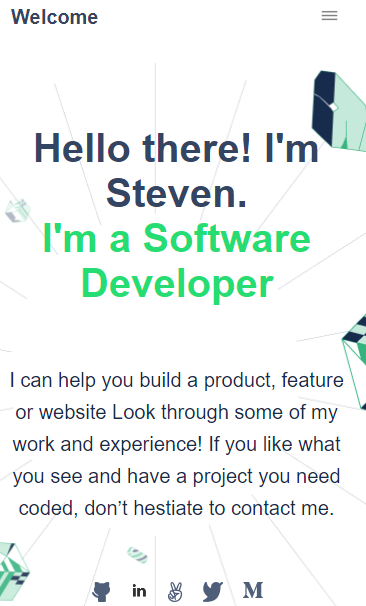
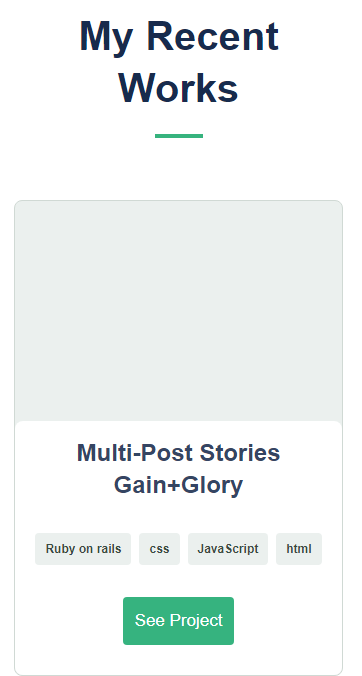
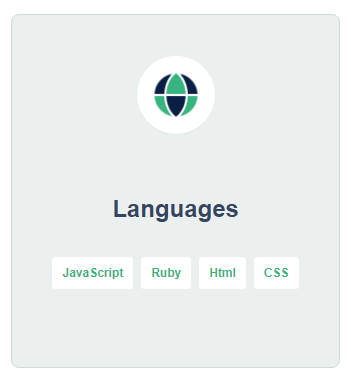
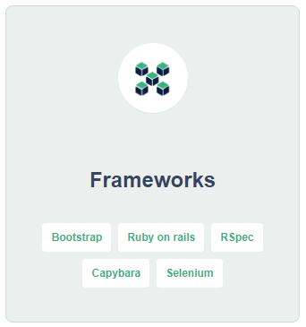
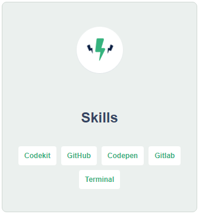
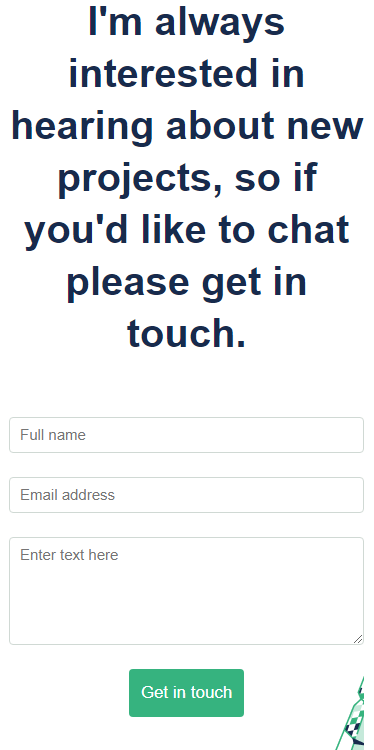

# Portfolio: Mobile Version

> A mobile version web app that displays my portfolio.
> The app displays different aspects and skills, from technical to general skills.

## Built With

- html
- css
- JavaScript

## Screenshots

### Homepage

### My Recent Works Page

### Languages Page

### Frameworks Page

### Skills Page

### Get-in-touch Page

## Getting Started

To get a local copy up and running follow these simple example steps.

### Prerequisites

### Setup

### Install

### Usage

### Run tests

### Deployment

## Authors

👤 **Steve**

- GitHub: [@github-profile](https://github.com/sntakirutimana72)

👤 **Mohammed Raad**

- GitHub: [@github-profile](https://github.com/MoRaad97)

## 🤝 Contributing

Contributions, issues, and feature requests are welcome!

Feel free to check the [issues page](../../issues/).

## Show your support

Give a ⭐️ if you like this project!

## Acknowledgments

- Fellow Micronauts
